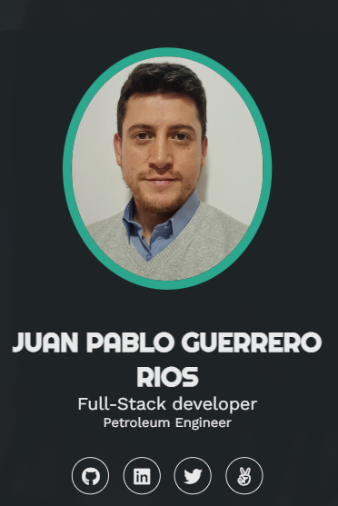

# Personal Portfolio

  
    
   

# 📖 Portfolio 

**Portfolio** is a responsive application that show my expertise in development and my education as an engineer. User will be able to download my resume and leave a message in the case they wan to contact me.

## 🛠 Built With 

<ul>
    <li><a href="https://developer.mozilla.org/en-US/docs/Web/CSS">CSS3</a></li>
    <li><a href="https://developer.mozilla.org/en-US/docs/Web/HTML">HTML5</a></li>
    <li><a href="https://developer.mozilla.org/en-US/docs/Web/JavaScript">Javascript</a></li>
  </ul>

(<a href="#readme-top">back to top</a>)

### Live Demo 
- Check out the [live demo]()

## 👥 Authors 

👤 **Juan Pablo Guerrero**

- GitHub: [@Juan Pablo Guerrero](https://github.com/Juanpa8830)
- LinkedIn: [@Juan Pablo Guerrero](https://www.linkedin.com/in/juanpabloguerrerorios/)

## 🤝 Contributing 

Contributions, issues, and feature requests are welcome!

Feel free to check the [issues page](https://github.com/juanpa8830/portfolio/issues).

(<a href="#readme-top">back to top</a>)

## ⭐️ Show your support 

Give a ⭐️ if you like this project!

(<a href="#readme-top">back to top</a>)

## 🙏 Acknowledgments 

I would like to thank the Microverse team for giving me the tools to learn how to work with this stacks.

(<a href="#readme-top">back to top</a>)

## 📝 License 

This project is [MIT](./LICENSE) licensed.

(<a href="#readme-top">back to top</a>)
